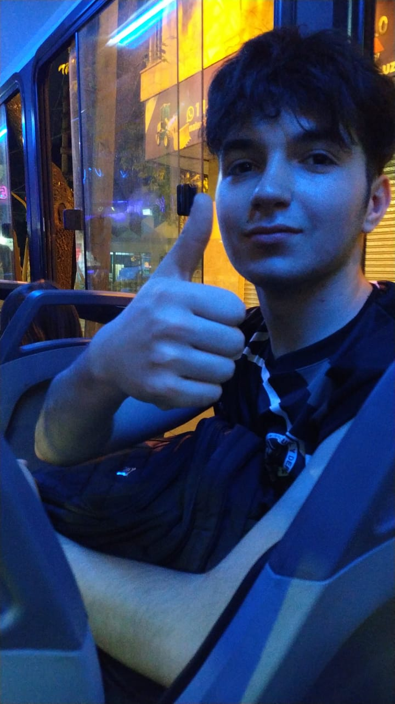

# Programación con objetos I

<h1><b>Presentacion Personal</b></h1>

<h2>Joaquin Garcia<h2>

Hola, soy Joaquin. Vivo en ituzaingo, tengo 20 años y actualmente estoy cursando Programacion con Objetos I, es mi primer cuatrimestre cursando la carrera. Empece a estudiar la carrera de Tecnicatura Universitaria en Programacion en 2025, y estoy actualmente en 2do año.

Me recibi de Tecnico en Progrmacion en la EEST Nro 6 "Chacabuco" en 2024. 

Mi primer acercamiento a la informatica fue cuando era chico, impulsado por los videojuegos. Queria entender como se hacian, y como funcionaban internamente. Debido a eso estudie programacion en la secundaria y hoy sigo formandome en la unahur. He trabajado en otros projectos, principalmente paginas web. Y ya he usado ciertas tecnologias, como CSS, JS, HTML, Python, Node, C++, PHP, etc.

Actualmente vivo en Ituzaingo, tengo 2 gatos. Ademas de la informatica o los videojuegos, tengo hobbies muy vinculados al deporte. Jugue en un club de voley por 2 años, y juego al futbol con mis amigos desde que tengo memoria.